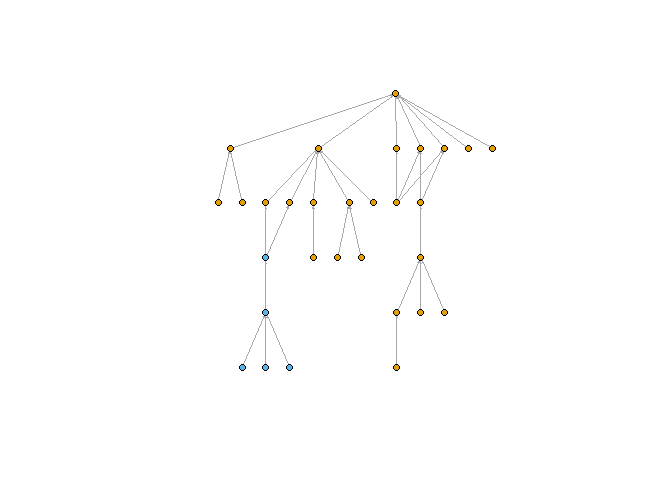
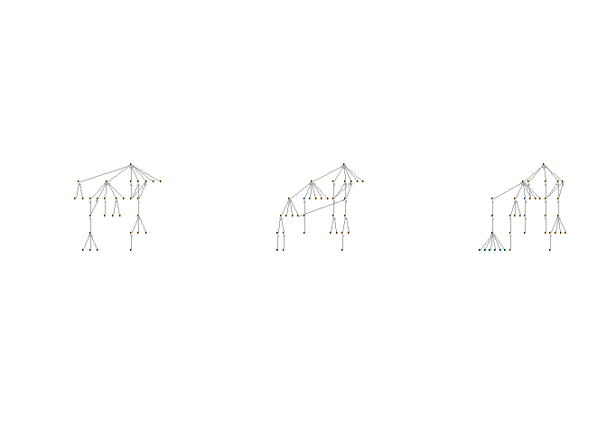
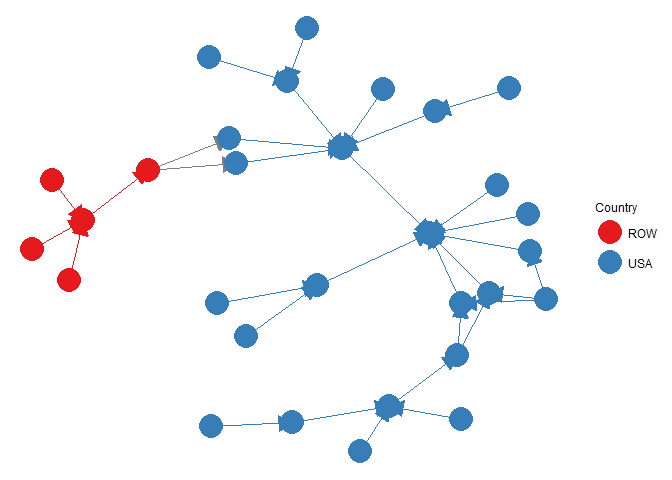

GVTr
================

Global Value Trees in R
=======================

This package presents a set of functions to implement the Global Value Tree (GVT) analysis approach of world input-output data (WIOD) developed by:
Zhu Z, Puliga M, Cerina F, Chessa A, Riccaboni M (2015) Global Value Trees. PLoS ONE 10(5): e0126699. <https://doi.org/10.1371/journal.pone.0126699>

The packagae allows you to:
-Load WIOD data for 2000 - 2014
-Create a value added contribution matrix/edgelist/network from the WIOD
-Create a GVT for a root country-industry node
-Plot GVT

Packages
--------

This package uses a number of other packages.

``` r
library(igraph)
library(dplyr)
library(plyr)
library(ggplot2)
library(GGally)
library(intergraph)
library(sna)
library(decompr)
#I would recommend installing decompr using:
#devtools::install_github("bquast/decompr")

#Install this package:
#library(devtools)
#devtools::install_github("MatthewSmith430/GVTr")
library(GVTr)
```

    ## 
    ## Attaching package: 'igraph'

    ## The following objects are masked from 'package:stats':
    ## 
    ##     decompose, spectrum

    ## The following object is masked from 'package:base':
    ## 
    ##     union

    ## 
    ## Attaching package: 'dplyr'

    ## The following objects are masked from 'package:igraph':
    ## 
    ##     as_data_frame, groups, union

    ## The following objects are masked from 'package:stats':
    ## 
    ##     filter, lag

    ## The following objects are masked from 'package:base':
    ## 
    ##     intersect, setdiff, setequal, union

    ## -------------------------------------------------------------------------

    ## You have loaded plyr after dplyr - this is likely to cause problems.
    ## If you need functions from both plyr and dplyr, please load plyr first, then dplyr:
    ## library(plyr); library(dplyr)

    ## -------------------------------------------------------------------------

    ## 
    ## Attaching package: 'plyr'

    ## The following objects are masked from 'package:dplyr':
    ## 
    ##     arrange, count, desc, failwith, id, mutate, rename, summarise,
    ##     summarize

    ## 
    ## Attaching package: 'GGally'

    ## The following object is masked from 'package:dplyr':
    ## 
    ##     nasa

    ## Loading required package: statnet.common

    ## Loading required package: network

    ## network: Classes for Relational Data
    ## Version 1.13.0 created on 2015-08-31.
    ## copyright (c) 2005, Carter T. Butts, University of California-Irvine
    ##                     Mark S. Handcock, University of California -- Los Angeles
    ##                     David R. Hunter, Penn State University
    ##                     Martina Morris, University of Washington
    ##                     Skye Bender-deMoll, University of Washington
    ##  For citation information, type citation("network").
    ##  Type help("network-package") to get started.

    ## 
    ## Attaching package: 'network'

    ## The following object is masked from 'package:plyr':
    ## 
    ##     is.discrete

    ## The following objects are masked from 'package:igraph':
    ## 
    ##     %c%, %s%, add.edges, add.vertices, delete.edges,
    ##     delete.vertices, get.edge.attribute, get.edges,
    ##     get.vertex.attribute, is.bipartite, is.directed,
    ##     list.edge.attributes, list.vertex.attributes,
    ##     set.edge.attribute, set.vertex.attribute

    ## sna: Tools for Social Network Analysis
    ## Version 2.4 created on 2016-07-23.
    ## copyright (c) 2005, Carter T. Butts, University of California-Irvine
    ##  For citation information, type citation("sna").
    ##  Type help(package="sna") to get started.

    ## 
    ## Attaching package: 'sna'

    ## The following objects are masked from 'package:igraph':
    ## 
    ##     betweenness, bonpow, closeness, components, degree,
    ##     dyad.census, evcent, hierarchy, is.connected, neighborhood,
    ##     triad.census

    ## Please consider citing both R and decompr,
    ## using citation() and citation("decompr")

Load Data
---------

You can load the WIOD using the following:

``` r
data("wiot2000")
```

This load in the world-input output table, in the above example, this is loaded for the year 2000 (years 2000-2014 are currently available).

Value Added Contribution matrix/edgelist/network
------------------------------------------------

The following functions creates a value added contribution objects from the wiot data.

``` r
EL<-VACel(wiot2000) #Value added contribution edgelist
NET<-VACnet(wiot2000) #Value added contribution network
MAT<-VACmat(wiot2000) #Value added contribution matrix
```

GVT - Tree Prune
----------------

This command creates a Global Value Tree (as an igraph object) for specific root country-industry node. In creating this GVT - we examine the ties incoming, directed towards the root node.
The edge threshold is employed as the complete and unfiltered Global Value Network is almost completely connected, therefore an edge threshold aids in helping retain only the more important value added ties. This produces a tree that shows the upstream value system of the country-industry. We only have a function for the upstream value system in the first instance, as upstream ties are noted to be more important for many manufacturing sectors, such as the automotive sector.
For the `GVTprune` function, you need to specify the wiot data (that can be loaded using the package)edge threshold,root country-sector node, (see <http://www.wiod.org/release16> for data description and coverage details) and the maximum number of layers to be included in the GVT.

``` r
#Example Root Node - USA Automotive Sector
USAauto<-GVTprune(wiot2000,0.019,"USA.C29",5)
```

Plots
-----

There are two plot options that come with this package.
1.) Tree Plot - uses a tree layout to plot the GVT
2.) Standard network layout
\#\#\# Tree Plot In the tree plot, the nodes are coloured by country or industry. The root node is at the top of the tree. You need to specify the GVT (calculated using `GVTprune`) and what you want the colour to be country/industry.

``` r
library(GVTr)
library(igraph)
```

    ## 
    ## Attaching package: 'igraph'

    ## The following objects are masked from 'package:stats':
    ## 
    ##     decompose, spectrum

    ## The following object is masked from 'package:base':
    ## 
    ##     union

``` r
library(plyr)
##Load Data
data("wiot2000")

##Create Tree
USAauto<-GVTprune(wiot2000,0.019,"USA.C29",5)
```

    ## Warning in igraph::distances(G1, mode = "in", algorithm = "unweighted"):
    ## Unweighted algorithm chosen, weights ignored

    ## Warning in igraph::distances(Hgraph, mode = "in", algorithm =
    ## "unweighted"): Unweighted algorithm chosen, weights ignored

    ## Warning in (function (..., deparse.level = 1) : number of columns of result
    ## is not a multiple of vector length (arg 1)

``` r
##Create Plot
gvtBasePlot(USAauto,"country")
```



The `pryr` package can be used to plot a panel of tree plots, showing visualisation of the same tree over time, or showing tree in the same sector for different countries. Below is the example of a panel of plots for the USA auto sector over time.

``` r
library(GVTr)
library(igraph)
library(plyr)
library(pryr)
```

    ## 
    ## Attaching package: 'pryr'

    ## The following object is masked from 'package:igraph':
    ## 
    ##     compose

``` r
##Load Data
data("wiot2000")
data("wiot2004")
data("wiot2008")

##Create Trees
USAauto2000<-GVTprune(wiot2000,0.019,"USA.C29",5)
```

    ## Warning in igraph::distances(G1, mode = "in", algorithm = "unweighted"):
    ## Unweighted algorithm chosen, weights ignored

    ## Warning in igraph::distances(Hgraph, mode = "in", algorithm =
    ## "unweighted"): Unweighted algorithm chosen, weights ignored

    ## Warning in (function (..., deparse.level = 1) : number of columns of result
    ## is not a multiple of vector length (arg 1)

``` r
USAauto2004<-GVTprune(wiot2004,0.019,"USA.C29",5)
```

    ## Warning in igraph::distances(G1, mode = "in", algorithm = "unweighted"):
    ## Unweighted algorithm chosen, weights ignored

    ## Warning in igraph::distances(Hgraph, mode = "in", algorithm =
    ## "unweighted"): Unweighted algorithm chosen, weights ignored

    ## Warning in (function (..., deparse.level = 1) : number of columns of result
    ## is not a multiple of vector length (arg 1)

``` r
USAauto2008<-GVTprune(wiot2008,0.019,"USA.C29",5)
```

    ## Warning in igraph::distances(G1, mode = "in", algorithm = "unweighted"):
    ## Unweighted algorithm chosen, weights ignored

    ## Warning in igraph::distances(Hgraph, mode = "in", algorithm =
    ## "unweighted"): Unweighted algorithm chosen, weights ignored

    ## Warning in (function (..., deparse.level = 1) : number of columns of result
    ## is not a multiple of vector length (arg 1)

``` r
##Create & save plots using gvtBasePlot & pryr
p1 %<a-% {
  gvtBasePlot(USAauto2000,"country")
}

p2 %<a-% {
  gvtBasePlot(USAauto2004,"country")
}
p3 %<a-% {
  gvtBasePlot(USAauto2008,"country")
}

##Plot GVTs
split.screen(c(1, 3))
```

    ## [1] 1 2 3

``` r
screen(1)
p1
screen(2)
p2
screen(3)
p3
```



``` r
close.screen(all=TRUE) 
```

### Standard Plot

In this plot, the network takes a more typical layout (and not a tree layout). Node are coloured on the basis of country, and ties colour indicates whether links are intra or inter country. You need to specify the GVT (calculated using `GVTprune`) and whether labels are present (TRUE/FALSE).

``` r
library(GVTr)
library(ggplot2)
library(GGally)
##Load Data
data("wiot2000")

##Create Tree
USAauto<-GVTprune(wiot2000,0.019,"USA.C29",5)
```

    ## Warning in igraph::distances(G1, mode = "in", algorithm = "unweighted"):
    ## Unweighted algorithm chosen, weights ignored

    ## Warning in igraph::distances(Hgraph, mode = "in", algorithm =
    ## "unweighted"): Unweighted algorithm chosen, weights ignored

    ## Warning in (function (..., deparse.level = 1) : number of columns of result
    ## is not a multiple of vector length (arg 1)

``` r
##Create Plot
GVTplot(USAauto,FALSE)
```

    ## Loading required package: network

    ## network: Classes for Relational Data
    ## Version 1.13.0 created on 2015-08-31.
    ## copyright (c) 2005, Carter T. Butts, University of California-Irvine
    ##                     Mark S. Handcock, University of California -- Los Angeles
    ##                     David R. Hunter, Penn State University
    ##                     Martina Morris, University of Washington
    ##                     Skye Bender-deMoll, University of Washington
    ##  For citation information, type citation("network").
    ##  Type help("network-package") to get started.

    ## 
    ## Attaching package: 'network'

    ## The following object is masked from 'package:plyr':
    ## 
    ##     is.discrete

    ## The following objects are masked from 'package:igraph':
    ## 
    ##     %c%, %s%, add.edges, add.vertices, delete.edges,
    ##     delete.vertices, get.edge.attribute, get.edges,
    ##     get.vertex.attribute, is.bipartite, is.directed,
    ##     list.edge.attributes, list.vertex.attributes,
    ##     set.edge.attribute, set.vertex.attribute

    ## Loading required package: sna

    ## Loading required package: statnet.common

    ## sna: Tools for Social Network Analysis
    ## Version 2.4 created on 2016-07-23.
    ## copyright (c) 2005, Carter T. Butts, University of California-Irvine
    ##  For citation information, type citation("sna").
    ##  Type help(package="sna") to get started.

    ## 
    ## Attaching package: 'sna'

    ## The following objects are masked from 'package:igraph':
    ## 
    ##     betweenness, bonpow, closeness, components, degree,
    ##     dyad.census, evcent, hierarchy, is.connected, neighborhood,
    ##     triad.census

    ## Loading required package: scales



Coverage
--------

Below is the coverage of the 2016 WIOD release. It lists the sectors covered - including the sector code and corresponding description. The country coverage lists the countries codes covered and the full country name.

### Sector Coverage

<table style="width:15%;">
<colgroup>
<col width="8%" />
<col width="6%" />
</colgroup>
<thead>
<tr class="header">
<th align="center"><strong>Sector Code</strong></th>
<th align="left"><strong>Description</strong></th>
</tr>
</thead>
<tbody>
<tr class="odd">
<td align="center">A01</td>
<td align="left">Crop and animal production, hunting and related service activities</td>
</tr>
<tr class="even">
<td align="center">A02</td>
<td align="left">Forestry and logging</td>
</tr>
<tr class="odd">
<td align="center">A03</td>
<td align="left">Fishing and aquaculture</td>
</tr>
<tr class="even">
<td align="center">B</td>
<td align="left">Mining and quarrying</td>
</tr>
<tr class="odd">
<td align="center">C10-C12</td>
<td align="left">Manufacture of food products, beverages and tobacco products</td>
</tr>
<tr class="even">
<td align="center">C13-C15</td>
<td align="left">Manufacture of textiles, wearing apparel and leather products</td>
</tr>
<tr class="odd">
<td align="center">C16</td>
<td align="left">Manufacture of wood and of products of wood and cork, except furniture; manufacture of articles of straw and plaiting materials</td>
</tr>
<tr class="even">
<td align="center">C17</td>
<td align="left">Manufacture of paper and paper products</td>
</tr>
<tr class="odd">
<td align="center">C18</td>
<td align="left">Printing and reproduction of recorded media</td>
</tr>
<tr class="even">
<td align="center">C19</td>
<td align="left">Manufacture of coke and refined petroleum products</td>
</tr>
<tr class="odd">
<td align="center">C20</td>
<td align="left">Manufacture of chemicals and chemical products</td>
</tr>
<tr class="even">
<td align="center">C21</td>
<td align="left">Manufacture of basic pharmaceutical products and pharmaceutical preparations</td>
</tr>
<tr class="odd">
<td align="center">C22</td>
<td align="left">Manufacture of rubber and plastic products</td>
</tr>
<tr class="even">
<td align="center">C23</td>
<td align="left">Manufacture of other non-metallic mineral products</td>
</tr>
<tr class="odd">
<td align="center">C24</td>
<td align="left">Manufacture of basic metals</td>
</tr>
<tr class="even">
<td align="center">C25</td>
<td align="left">Manufacture of fabricated metal products, except machinery and equipment</td>
</tr>
<tr class="odd">
<td align="center">C26</td>
<td align="left">Manufacture of computer, electronic and optical products</td>
</tr>
<tr class="even">
<td align="center">C27</td>
<td align="left">Manufacture of electrical equipment</td>
</tr>
<tr class="odd">
<td align="center">C28</td>
<td align="left">Manufacture of machinery and equipment n.e.c.</td>
</tr>
<tr class="even">
<td align="center">C29</td>
<td align="left">Manufacture of motor vehicles, trailers and semi-trailers</td>
</tr>
<tr class="odd">
<td align="center">C30</td>
<td align="left">Manufacture of other transport equipment</td>
</tr>
<tr class="even">
<td align="center">C31_C32</td>
<td align="left">Manufacture of furniture; other manufacturing</td>
</tr>
<tr class="odd">
<td align="center">C33</td>
<td align="left">Repair and installation of machinery and equipment</td>
</tr>
<tr class="even">
<td align="center">D35</td>
<td align="left">Electricity, gas, steam and air conditioning supply</td>
</tr>
<tr class="odd">
<td align="center">E36</td>
<td align="left">Water collection, treatment and supply</td>
</tr>
<tr class="even">
<td align="center">E37-E39</td>
<td align="left">Sewerage; waste collection, treatment and disposal activities; materials recovery; remediation activities and other waste management services</td>
</tr>
<tr class="odd">
<td align="center">F</td>
<td align="left">Construction</td>
</tr>
<tr class="even">
<td align="center">G45</td>
<td align="left">Wholesale and retail trade and repair of motor vehicles and motorcycles</td>
</tr>
<tr class="odd">
<td align="center">G46</td>
<td align="left">Wholesale trade, except of motor vehicles and motorcycles</td>
</tr>
<tr class="even">
<td align="center">G47</td>
<td align="left">Retail trade, except of motor vehicles and motorcycles</td>
</tr>
<tr class="odd">
<td align="center">H49</td>
<td align="left">Land transport and transport via pipelines</td>
</tr>
<tr class="even">
<td align="center">H50</td>
<td align="left">Water transport</td>
</tr>
<tr class="odd">
<td align="center">H51</td>
<td align="left">Air transport</td>
</tr>
<tr class="even">
<td align="center">H52</td>
<td align="left">Warehousing and support activities for transportation</td>
</tr>
<tr class="odd">
<td align="center">H53</td>
<td align="left">Postal and courier activities</td>
</tr>
<tr class="even">
<td align="center">I</td>
<td align="left">Accommodation and food service activities</td>
</tr>
<tr class="odd">
<td align="center">J58</td>
<td align="left">Publishing activities</td>
</tr>
<tr class="even">
<td align="center">J59_J60</td>
<td align="left">Motion picture, video and television programme production, sound recording and music publishing activities; programming and broadcasting activities</td>
</tr>
<tr class="odd">
<td align="center">J61</td>
<td align="left">Telecommunications</td>
</tr>
<tr class="even">
<td align="center">J62_J63</td>
<td align="left">Computer programming, consultancy and related activities; information service activities</td>
</tr>
<tr class="odd">
<td align="center">K64</td>
<td align="left">Financial service activities, except insurance and pension funding</td>
</tr>
<tr class="even">
<td align="center">K65</td>
<td align="left">Insurance, reinsurance and pension funding, except compulsory social security</td>
</tr>
<tr class="odd">
<td align="center">K66</td>
<td align="left">Activities auxiliary to financial services and insurance activities</td>
</tr>
<tr class="even">
<td align="center">L68</td>
<td align="left">Real estate activities</td>
</tr>
<tr class="odd">
<td align="center">M69_M70</td>
<td align="left">Legal and accounting activities; activities of head offices; management consultancy activities</td>
</tr>
<tr class="even">
<td align="center">M71</td>
<td align="left">Architectural and engineering activities; technical testing and analysis</td>
</tr>
<tr class="odd">
<td align="center">M72</td>
<td align="left">Scientific research and development</td>
</tr>
<tr class="even">
<td align="center">M73</td>
<td align="left">Advertising and market research</td>
</tr>
<tr class="odd">
<td align="center">M74_M75</td>
<td align="left">Other professional, scientific and technical activities; veterinary activities</td>
</tr>
<tr class="even">
<td align="center">N</td>
<td align="left">Administrative and support service activities</td>
</tr>
<tr class="odd">
<td align="center">O84</td>
<td align="left">Public administration and defence; compulsory social security</td>
</tr>
<tr class="even">
<td align="center">P85</td>
<td align="left">Education</td>
</tr>
<tr class="odd">
<td align="center">Q</td>
<td align="left">Human health and social work activities</td>
</tr>
<tr class="even">
<td align="center">R_S</td>
<td align="left">Other service activities</td>
</tr>
<tr class="odd">
<td align="center">T</td>
<td align="left">Activities of households as employers; undifferentiated goods- and services-producing activities of households for own use</td>
</tr>
<tr class="even">
<td align="center">U</td>
<td align="left">Activities of extraterritorial organizations and bodies</td>
</tr>
</tbody>
</table>

### Country Coverage

| **Country Code** | **Country Name** | **Country Code** |     **Country Name**     |
|:----------------:|:----------------:|:----------------:|:------------------------:|
|        AUS       |     Australia    |        IRL       |          Ireland         |
|        AUT       |      Austria     |        ITA       |           Italy          |
|        BEL       |      Belgium     |        JPN       |           Japan          |
|        BGR       |     Bulgaria     |        KOR       |           Korea          |
|        BRA       |      Brazil      |        LTU       |         Lithuania        |
|        CAN       |      Canada      |        LUX       |        Luxembourg        |
|        CHE       |    Switzerland   |        LVA       |          Latvia          |
|        CHN       |       China      |        MEX       |          Mexico          |
|        CYP       |      Cyprus      |        MLT       |           Malta          |
|        CZE       |  Czech Republic  |        NLD       |        Netherlands       |
|        DEU       |      Germany     |        NOR       |          Norway          |
|        DNK       |      Denmark     |        POL       |          Poland          |
|        ESP       |       Spain      |        PRT       |         Portugal         |
|        EST       |      Estonia     |        ROU       |          Romania         |
|        FIN       |      Finland     |        ROW       |     Rest of the world    |
|        FRA       |      France      |        RUS       |          Russia          |
|        GBR       |   Great Britain  |        SVK       |         Slovakia         |
|        GRC       |      Greece      |        SVN       |         Slovenia         |
|        HRV       |      Croatia     |        SWE       |          Sweden          |
|        HUN       |      Hungary     |        TUR       |          Turkey          |
|        IDN       |     Indonesia    |        TWN       |          Taiwan          |
|        IND       |       India      |        USA       | United States of America |
